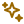

<h1 align="center">Hi, I'm Qizhen Lan</h1>

  Postdoctoral Research Fellow at <a href="https://www.uth.edu/">UTHealth Houston</a>

  <a href="https://lanqz7766.github.io/"> Website</a> ·
  <a href="https://scholar.google.com/citations?user=hz8cb2AAAAAJ&hl=en&oi=ao"> Google Scholar</a> ·
  <a href="https://lanqz7766.github.io/assets/files/curriculum_vitae.pdf"> CV</a> ·
  <a href="https://www.linkedin.com/in/qizhen-lan/"> LinkedIn</a> ·
  <a href="mailto:Qizhen.Lan@uth.tmc.edu"> Email</a>

I build AI systems at the intersection of visual intelligence, efficient learning, and agentic workflows. My work spans computer vision, medical imaging, model compression, multimodal reasoning, and reliable AI systems, with a practical focus on methods that hold up beyond curated benchmarks.

I am currently exploring workflow-facing AI, including clinical agents, deployable medical AI, trustworthy evaluation, and efficient models under real resource constraints.

## Recent repositories (not a publication list)

 Selected research releases, codebases, and project pages.

 **[MICCAI 2026]** [DCD-3D-MedSeg](https://github.com/ClinicaAlpha/DCD-3D-MedSeg): Detail-consistent stage-wise distillation for efficient 3D MRI segmentation. 

 **[MICCAI 2026]** [DPRD-3D-MedSeg](https://github.com/ClinicaAlpha/DPRD-3D-MedSeg): Displacement-preserving relational distillation for robust medical segmentation. 

 **[ACL 2026 Main, Oral]** [KnowMeBench](https://github.com/QuantaAlpha/KnowMeBench): A benchmark for understanding people in lifelong digital companions. 

 **[ECCV 2026]** [VIGIL](https://xixiaouab.github.io/VIGIL/): Counterfactual visual alignment for reducing visual laziness in MLLMs. 

 **[WACV 2024]** [GKD](https://github.com/lanqz7766/GKD): Gradient-guided knowledge distillation for object detectors. 

## Recent updates

- [2026] Three papers accepted to MICCAI, including two early accepts.
- [2026] KnowMeBench accepted to ACL Main as an Oral Presentation.
- [2026] VIGIL accepted to ECCV.
- [2026] One paper accepted to *Neural Networks*.

## Connect

I welcome research internships, visiting opportunities, collaborations, and conversations around practical AI systems. If our interests overlap, or you would simply like to exchange ideas, please [get in touch](mailto:Qizhen.Lan@uth.tmc.edu).
